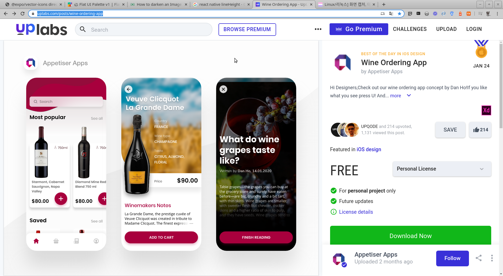
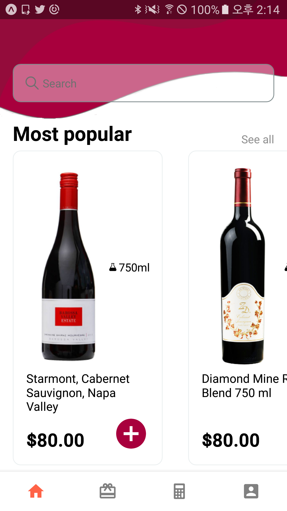
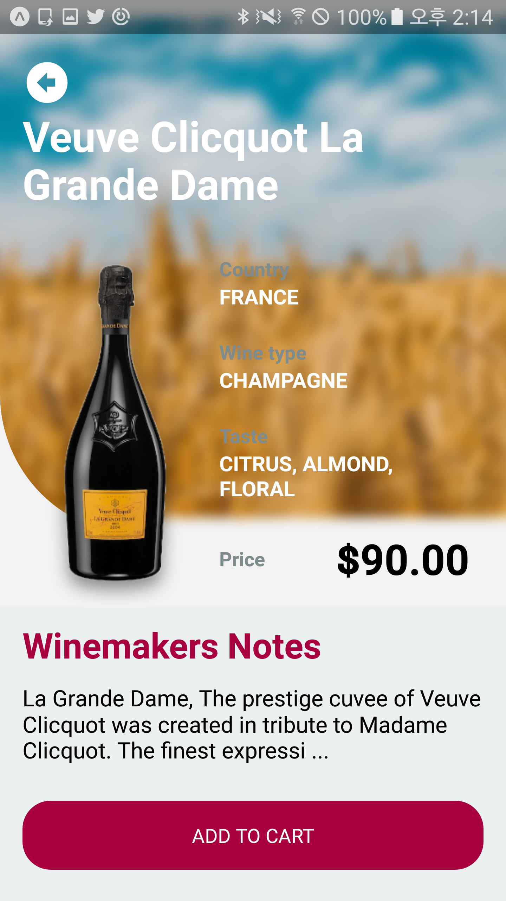
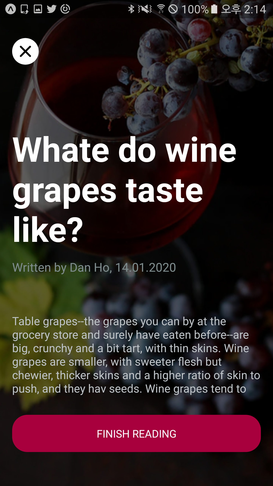

# neko-wine-ordering
React Native with Expo, Front UI


## Init
- yarn add @react-navigation/native
- expo install react-native-gesture-handler react-native-reanimated react-native-screens react-native-safe-area-context @react-native-community/masked-view

## Tab with Stack
- yarn add @react-navigation/stack
- yarn add @react-navigation/bottom-tabs
- createStacknavigator
- createBottomTabNavigator
- createMaterialBottomNavigator
- createMaterialTopTabNavigator

## ImageBackground darker
```
 <ImageBackground
    source={require('../assets/pop-back.png')}
    style={{width, height}}
    >
    <View style={{width, height,backgroundColor: 'rgba(0,0,0, 0.60)'}}>
        <!-- blaha... -->
    </View>
</ImageBackground>
```


## Tree
* Stack.Navigator
    * Root (RootTab)
        * Home (HomeScreen)
        * Cart (CartScreen)
        * Calc (CalcScreen)
        * My (MyScreen)
    * Detail (DetailScreen)
    * Pop (PopScreen)


## Designed by
- https://www.uplabs.com/posts/wine-ordering-app


## Result Captures
|Home|Detail|Pop|
|:---:|:---:|:---:|
||||


